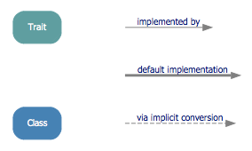
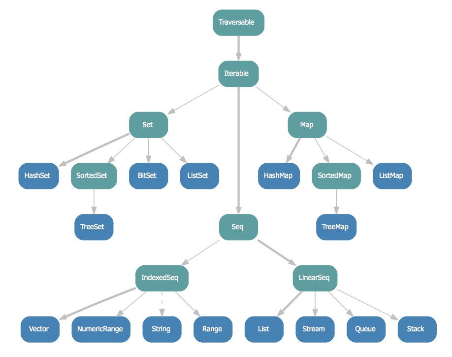

Following [the previous post](./2013-05-11-venture-out-on-canbuildfrom.html),
I would like to have a really functioning _CanBuildFrom_ instead of a do-nothing 
one. In other words, it should be able to build a collection. In the
collection library, _CanBuildFrom_ is deeply related to another trait called 
_Builder_ which is going to be talked about in this article. Note that only 
Builder itself will be discussed here. Its relationship to _CanBuildFrom_ will be
saved for [another post].

I'll continue building a _Q_ collection that mimics the collection library, 
at least cosmetically. Some understanding
of how collections are organized in the library is necessary. For that matter, 
[this discussion](http://stackoverflow.com/questions/1722137/scala-2-8-collections-design-tutorial?lq=1)
does a fantastic job. The pictures below are copied from
[here](https://github.com/sirthias/scala-collections-charts/downloads) and they are very helpful.
 

It can be seen from the pictures that for a trait A, there's a most-derived 
concrete class which builds the underlying object exposes the trait A as type.

        scala> val sq = Seq(10,11)
        sq: Seq[Int] = List(10, 11)

Having these pictures in mind, let's start to flesh out the Q collection from 
[the previous post](./2013-05-11-venture-out-on-canbuildfrom.html).
In the end, those additional entities will be created to mimic the collection library:

    Budr                ---     Builder
    QCompanion          ---     GenericCompanion
    QArrBuf             ---     ArrayBuffer

The newly added _Budr_ is like _collection.mutable.Builder_ but is simplified 
a lot. It helps to build a collection of type _To_ containing elements of type
_Elm_. 

    trait Budr[-Elm, +To] {
      def +=(elem: Elm): this.type
      def result(): To
    }

QCompanion has the _empty_ and _apply_ that helps to create Q collection, with
the help of _newBuilder_ which Q1's companion must provide.

    trait QCompanion[+CC[_]] {
      // deriving companion object should implement newBuilder
      def newBuilder[A]: Budr[A, CC[A]]

      def empty[A]: CC[A] = newBuilder[A].result

      def apply[A](elems: A*): CC[A] = {
        if (elems.isEmpty) empty[A]
        else {
          val b = newBuilder[A]
          for (e <- elems) {
            b += e
          }
          b.result
        }
      }
    }

    trait QFac[CC[_]]
      extends QCompanion[CC] { ... }

    object Q1 extends QFac[Q1] {
      implicit def cbf[A]: CBF[Q1[_], A, Q1[A]] =
        reusableGCBF.asInstanceOf[GCBF[A]]

      // Budr[A, QArrBuf[A]] <: Budr[A, Q1[A]]
      def newBuilder[A] = new QArrBuf
    }

Looking into _QCompanion_'s apply to get a taste of how _Budr_ helps construct
a Q collection:

1. Use _newBuilder_ to get a _Budr_. 
2. Use _+=()_ on the _Budr_ to put element into it.
3. In the end, calling _result()_ on the _Budr_ to give the new collection in
   the question. 

In Q1 object, _newBuilder_ is defined as _QArrBuf_ which plays the role of a 
most-derived concrete class that builds the underlying collection. _QArrBuf_ 
itself derives __Budr[A, QArrBuf[A]]__ and __Q1__ so that it conforms to
polymorphic type Budr[A, Q1[A]]. 

_QArrBuf_ is the most-derived concrete class for the Q collection, and as 
stated before, itself is and implements a _Budr_.

    class QArrBuf[A] (initialSize: Int)
      extends Q1[A]
      with Budr[A, QArrBuf[A]] {

      // use mutable Array
      protected var array: Array[AnyRef] =
        new Array[AnyRef](math.max(initialSize, 1))

      protected var size0 = 0

      def this() = this(16)

      // FIXME: doesn't implement resizable array
      def +=(elem: A): this.type = {
        array(size0) = elem.asInstanceOf[AnyRef]
        size0 += 1
        this
      }

      def result(): QArrBuf[A] = this
    }

The implementation is no doubt incomplete and has lots of flaws. Nevertheless,
it's sufficient for points I make here.

Now I'd like to add another flavor, _Q2_, to the Q collection. Just like in 
the official collection library there are many traits on the way from concrete 
classes up to the root trait Traversable. Think
_Q1_ as _Traversable_, _Q2_ as _Iterable_ or any other deriving traits.

    trait Q2[+A] extends Q1[A] with QLike[A, Q2[A]]

    object Q2 extends QFac[Q2] {
      // Budr[A, QArrBuf[A]] <: Budr[A, Q2[A]]
      def newBuilder[A] = new QArrBuf
    }

To accommodate this trait, _QArrBuf_ has to be changed to derive Q2 because 
_QArrBuf_ _is the most-derived concrete class_:

    class QArrBuf[A] (initialSize: Int)
      extends Q2[A]
      with Budr[A, QArrBuf[A]] { ... }

Till now, the Q collection's hierarchy looks like:

    Q1 <- Q2 <- QArrBuf

Try _Q_s in REPL:

    scala> Q1(1,2,3)
    res0: Q1[Int] = QArrBuf@7e5ccc

    scala> Q2("one", "two", "three")
    res1: Q2[String] = QArrBuf@f4e077

[Gist](https://gist.github.com/cfchou/5713282)

###Reference###
[Scala 2.8 collections design tutorial](http://stackoverflow.com/questions/1722137/scala-2-8-collections-design-tutorial?lq=1)

