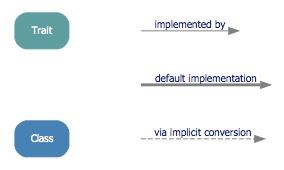

Following [the previous post](./2013-05-12-venture-out-on-canbuildfrom.html),
I would like to have a really functioning CanBuildFrom instead of a do-nothing 
demonstration. Which means it'll be able to build a collection.

My approach is to mimic collection library, at least cosmetically. Some understanding
of how collections are organized in the library is necessary. For that [this
discussion](http://stackoverflow.com/questions/1722137/scala-2-8-collections-design-tutorial?lq=1)
does a fantastic job. The pictures below are copied from [here](https://github.com/sirthias/scala-collections-charts/downloads) as they are very helpful.
 

* For a trait A, there's a most-derived concrete class that builds the
   underlying object exposes the trait A as type.

        scala> val sq = Seq(10,11)
        sq: Seq[Int] = List(10, 11)

* A method on that object might return an object typed as anther trait which 
   appears on the path from trait A to the root trait `Traversable`. As to 
   which trait the returned object exposes or how to control which trait the 
   returned object exposes, it's related to the function, CanBuildFrom and 
   Builder.

        scala> val it: Iterable[Int] = sq.map (_+1)
        it: Iterable[Int] = List(11, 12)

* In fact, it might even be able to return an object exposes a trait derived
  deeper than A, or a trait on a complete different path. This will be discussed 
  in another post.
        
        // LinearSeq derives Seq
        scala> val lsq: LinearSeq[Int] = sq.map (_+1).toList
        lsq: scala.collection.immutable.LinearSeq[Int] = List(11, 12)

        // The underlying object changes. In this case, Map to ArrayBuffer.
        scala> val m = Map(1 -> "no1", 2 -> "no2")
        m: scala.collection.immutable.Map[Int,String] = Map(1 -> no1, 2 -> no2)

        scala> val sqOfMap = m.toSeq
        sqOfMap: Seq[(Int, String)] = ArrayBuffer((1,no1), (2,no2))

Extending from [the previous post](./2013-05-12-venture-out-on-canbuildfrom.html),
more entities are created to mimic the collection library:

    Budr        ---     Builder
    QCompanion  ---     GenericCompanion
    QArrBuf     ---     ArrayBuffer

To start, _bar()_ which returns __That__ is added to _QLike_. 

    trait QLike[+A, +Repr] {
      def foo[B, That](q: B)(implicit cbf: CBF[Repr, B, That]): Int = 0
      def bar[B, That](q: B)(implicit cbf: CBF[Repr, B, That]): That = {
        val bdr = cbf()
        bdr += q
        bdr.result
      }
    }

    trait Budr[-Elm, +To] {
      def +=(elem: Elm): this.type
      def result(): To
    }

    trait CBF[-Fr, -Elm, +To] {
      def apply(): Budr[Elm, To]
    }

The newly added _Budr_ is like _collection.mutable.Builder_ but is simplified a lot.
_bar()'s_ implementation reveals the basic usage of it: 

1. Use _CBF_'s _apply()_ to provide a _Budr_. 
2. Use _+=()_ on the _Budr_ to put element into it.
3. In the end, _result()_ on the _Budr_ give the new collection of type __That__.

_GCBF_ needs to implement _apply()_ to provide _Budr_. This job is delegated to
_newBuilder_ that _Q1_'s companion object must implement.

    trait QCompanion[+CC[_]] {
      def newBuilder[A]: Budr[A, CC[A]]
    }
    trait QFac[CC[_]] extends QCompanion[CC] {

      class GCBF[A] extends CBF[CC[_], A, CC[A]] {
        def apply() = newBuilder[A]
      }
      // CBF[CC[_], Nothing, CC[Nothing]]
      lazy val reusableGCBF = new GCBF[Nothing]
    }

    trait Q1[+A] extends QLike[A, Q1[A]]

    object Q1 extends QFac[Q1] {
      implicit def cbf[A]: CBF[Q1[_], A, Q1[A]] =
      reusableGCBF.asInstanceOf[GCBF[A]]

      def apply[A](a: A): Q1[A] = new Q1[A]

      // Budr[A, QArrBuf[A]] <: Budr[A, Q1[A]]
      def newBuilder[A]: Budr[A, Q1[A]] = new QArrBuf[A]
    }

It can be seen that _QArrBuf_ plays the role of a most-derived concrete class that
builds the underlying collection. _QArrBuf_ itself derives __Budr[A, QArrBuf[A]]__
and __Q1__ so that it conforms to the polymorphic Budr[A, Q1[A]]. 

Before showing _QArrBuf_'s definition, I add another
flavor to the Q collection, _Q2_. Just like in the collection library there are many 
traits on the way from concrete classes up to the root trait Traversable. Think
_Q1_ as _Traversable_, _Q2_ as _Iterable_ or any other deriving traits.

    trait Q2[+A] extends Q1[A] with QLike[A, Q2[A]]

    object Q2 extends QFac[Q2] {

      def apply[A](a: A): Q2[A] = new Q1[A] {}

      // Budr[A, QArrBuf[A]] <: Budr[A, Q2[A]]
      def newBuilder[A] = new QArrBuf 
    }

_Q1_ and _Q2_ have a striking resemblance in their traits and companions except
the types of _apply()_ and _newBuilder_ are tailored for _Q2_, and no implicit CBF
is provided.

_QArrBuf_ is the most-derived concrete class for the Q collection, therefore it
derives from _Q2_. And as stated before, itself is a _Budr_.

    // mutable
    class QArrBuf[A] (initialSize: Int)
      extends Q2[A]
      with Budr[A, QArrBuf[A]] {

      protected var array: Array[AnyRef] =
        new Array[AnyRef](math.max(initialSize, 1))
      protected var size0 = 0

      def this() = this(16)

      // doesn't implement resizable array
      def +=(elem: A): this.type = {
        array(size0) = elem.asInstanceOf[AnyRef]
        size0 += 1
        this
      }
      def result(): QArrBuf[A] = this
    }

The implementation is no doubt incomplete and has lots of flaws. Nevertheless,
it's only used for showing the points I want to make.

Till now, the Q collection's hierarchy is:

    Q1 <- Q2 <- QArrBuf

Now go back to bar() and try it on Q1 in REPL:

    scala> val q1 = Q1(10)
    q1: Q1[Int] = Q1$$anon$2@48ef1

    scala> q1.bar("a string")
    res0: Q1[String] = QArrBuf@1eff84d

Like foo() [discuessed before](./2013-05-12-venture-out-on-canbuildfrom.html), 
bar() needs an implicit _CBF_, and it happily finds one in _Q1_'s companion:

    required: CBF[Q1[Int], String, Any]

    found:    CBF[Q1[_], String, Q1[String]]

The implicit _CBF_'s _apply()_ calls _newBuilder[String]_ to _new
QArrBuf[String]_ which
derives _Budr[String, QArrBuf[String]]_ and thus conforms to expected type
_Budr[String, Q1[String]]_.

Unlike _foo()_, _bar()_ needs type parameter __That__ as its type and _the found implicit helps
it to resolve that_ __That__ _is_ __Q1[String]__.

If I try _Q2.bar()_ in REPL:

    scala> val q2 = Q2(20)
    q2: Q2[Int] = Q2$$anon$1@1469fc2

    scala> q2.bar("a string")
    res0: Q1[String] = QArrBuf@1fea274

Note that the static type of _bar()_ in this case is _Q1[String]_ rather then
_Q2[String]_. This is what happened: when looking up an implicit CBF, it tries
Q2's companion but to no avail. Then the companion of Q2's superclass, Q1, is
tried. Therefore, Q1's implicit CBF is used and __That__ is resolved to be
Q1[String].

To support __That__ to be Q2 or Q1, or whatever trait in between(although no such
trait exists in the demonstration), an implicit CBF needs to be provided:

    object Q2 extends QFac[Q2] {
      implicit def cbf[A]: CBF[Q2[_], A, Q2[A]] =
        reusableGCBF.asInstanceOf[GCBF[A]]

      def apply[A](a: A): Q2[A] = new Q1[A] {}

      // Budr[A, QArrBuf[A]] <: Budr[A, Q2[A]]
      def newBuilder[A] = new QArrBuf 
    }

Finally, in REPL:
    
    scala> val q2 = Q2(20)
    q2: Q2[Int] = Q2$$anon$1@1396284

    scala> q2.bar("a string")
    res0: Q2[String] = QArrBuf@19af075

    scala> val q1: Q1[String] = q2.bar("a string")
    q1: Q1[String] = QArrBuf@fd23e4

[Gist](https://gist.github.com/cfchou/5713282)

One more thing needs to be addressed. It's ok if running _foo()_ on Q2:

    scala> val q2 = Q2("one", "two", "three")
    q2: Q2[String] = QArrBuf@afb54d

    scala> q2.foo(123)
    res3: Int = 0

It works even no implicit _CBF_ in O2's companion object is given. 
This is what happened: when looking up an implicit CBF, it tries
Q2's companion but to no avail. Then the companion of Q2's superclass, Q1, is
tried and Q1's implicit CBF is found and used. 

    required: CBF[Q2[String], Int, Any]

    found:    CBF[Q1[String], Int, Q1[Int]]

